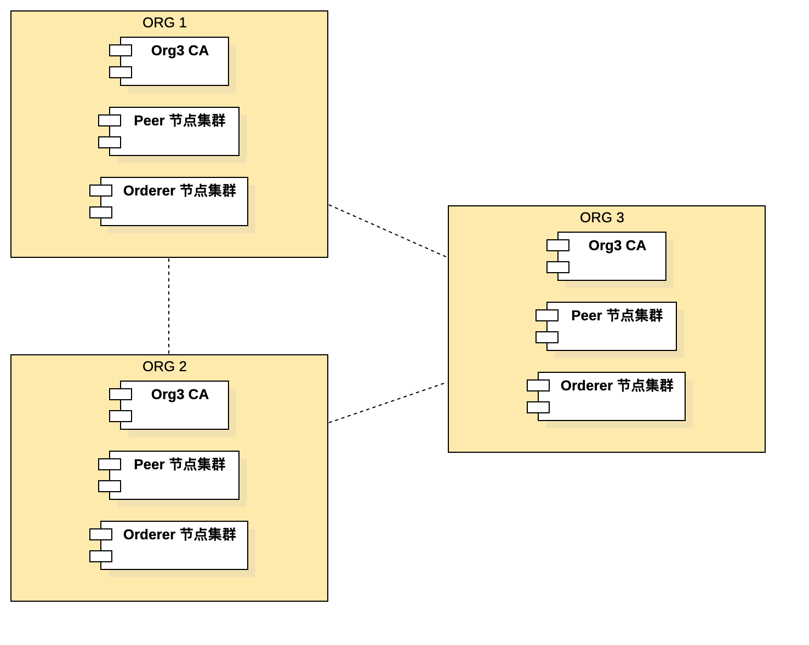

此脚本基于作者对 Hyperledger Fabric 项目的以下架构理解构建起来的：
* Hyperledger Fabric 联盟链能够链接不同的组织，在组织之间构建可信的链接。
* 组织是联盟链中的基本单位。
* 组织之间，使用 Channel 链接起来。
* Chaincode 代表了组织间业务往来的协议。

因此部署 Hyperledger Fabric 应该遵循以下步骤:
* 构建 Hyperledger Fabric 的组织，其中最关键的是组织的 MSP。
* 构建系统 Channel，在构建系统 Channel 时需要组织相关的信息。
* 部署用户 Channel 和 Chaincode。

